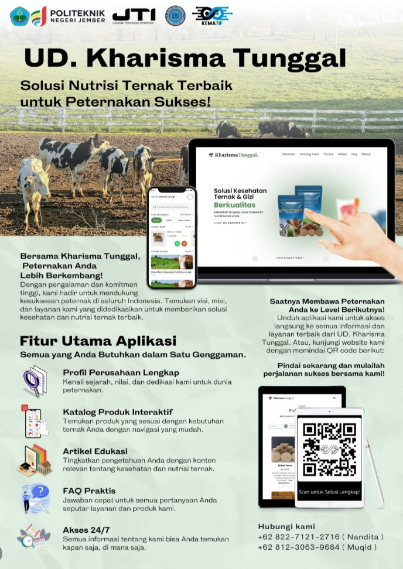

# 🐄 Kharisma Tunggal Company Profile

Aplikasi **Kharisma Tunggal Company Profile** merupakan platform berbasis **web** yang dirancang untuk menyediakan informasi lengkap mengenai perusahaan serta produk nutrisi ternak yang ditawarkan.  

Aplikasi ini bertujuan untuk membantu peternak dan masyarakat dalam memperoleh informasi mengenai **produk pakan ternak, edukasi nutrisi ternak, serta profil perusahaan** secara cepat dan mudah melalui platform digital.

Project ini juga dikembangkan sebagai bagian dari **pengembangan portfolio developer** dan pembelajaran dalam membangun aplikasi web berbasis sistem informasi.

---

# 🚀 Features

Beberapa fitur utama dalam aplikasi ini antara lain:

### 🏢 Company Profile
Menampilkan informasi lengkap mengenai perusahaan Kharisma Tunggal.

### 📦 Product Catalog
Menampilkan berbagai produk nutrisi ternak yang tersedia lengkap dengan deskripsi produk.

### 📚 Educational Articles
Menyediakan artikel edukasi mengenai nutrisi ternak dan manajemen peternakan.

### ❓ FAQ (Frequently Asked Questions)
Menyediakan jawaban dari pertanyaan yang sering diajukan oleh pengguna.

### ⚡ Responsive Web Design
Tampilan aplikasi dapat diakses dengan baik melalui berbagai perangkat seperti desktop maupun mobile.

---

# 🛠 Tech Stack

Teknologi yang digunakan dalam pengembangan aplikasi ini:

| Technology | Description |
|-----------|-------------|
| PHP | Bahasa pemrograman backend |
| Laravel | Framework backend |
| MySQL | Database management system |
| HTML5 | Struktur halaman web |
| CSS3 | Styling halaman |
| JavaScript | Interaktivitas pada website |
| Bootstrap | Framework UI |

---

# 📂 Project Structure

Struktur folder utama pada project:

```
kharisma-tunggal
│
├── app
├── config
├── database
├── public
├── resources
│   ├── views
│   ├── css
│   └── js
├── routes
├── storage
└── README.md
```

---

# ⚙️ Installation

Ikuti langkah berikut untuk menjalankan project secara lokal.

### 1. Clone repository

```
git clone https://github.com/username/kharisma-tunggal.git
```

### 2. Masuk ke folder project

```
cd kharisma-tunggal
```

### 3. Install dependency

```
composer install
```

### 4. Copy file environment

```
cp .env.example .env
```

### 5. Generate application key

```
php artisan key:generate
```

### 6. Jalankan server

```
php artisan serve
```

### 7. Akses aplikasi

```
http://localhost:8000
```

---

# 📸 Application 



---

# 📡 API Documentation

Beberapa endpoint API yang tersedia:

### Get Products
```
GET /api/products
```

### Get Articles
```
GET /api/articles
```

### Get FAQ
```
GET /api/faqs
```

---

# 👥 Contributors

Project ini dikembangkan oleh tim mahasiswa:

**M. Dien Vito Alivio Hidayat**  
NIM: E41231065  
Instagram: https://instagram.com/m.dien_vito

**Muhammad Yusron Kurniawan**  
NIM: E41231326  
Instagram: https://instagram.com/y.sron_

**Dymas Ersa Ramadhan**  
NIM: E41231177  
Instagram: https://instagram.com/dymaser

**Dema Adzhani**  
NIM: E41231272  
Instagram: https://instagram.com/demadzh

**Nandita Putri Hanifa Jannah**  
NIM: E41231216  
Instagram: https://instagram.com/na_nditaaph

**Abdul Muqid**  
NIM: E41231328  
Instagram: https://instagram.com/muqid__

---

# 🎯 Project Goals

Tujuan utama dari pengembangan aplikasi ini:

- Mempermudah akses informasi produk nutrisi ternak
- Menyediakan edukasi peternakan berbasis digital
- Mendukung digitalisasi layanan perusahaan
- Mengembangkan keterampilan pengembangan aplikasi web


